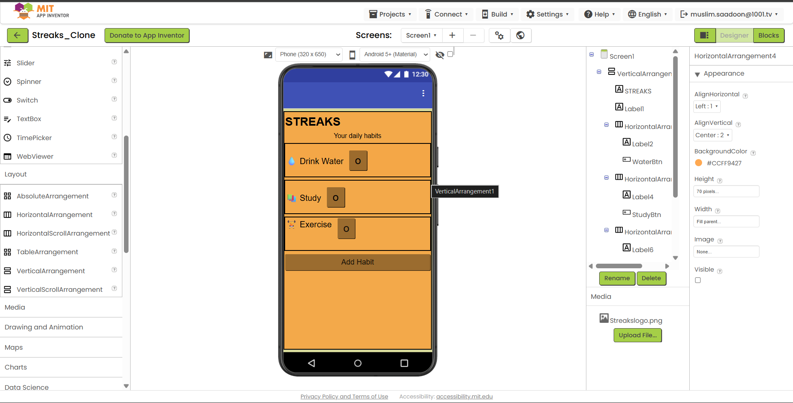
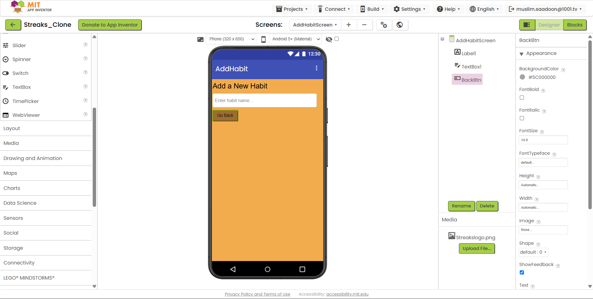

# StreakUp – Android App Builder Challenge

## Overview
A minimalist habit-tracking application built as part of the Android Development App Builder Challenge. The app displays daily habits, allows interactive completion toggling, and accepts custom entries via a secondary input screen.

---

## Deliverables & Links
- **Tool Used:** MIT App Inventor
- **Original Design Reference:** https://mobbin.com/apps/streaks-ios-ec5eee00-e0a8-4060-a969-379d4eae7c63/6b18a4df-08da-42c6-8494-468a9b6c7643/screens
- **APK Download:** [StreakUp.apk](./StreakUp.apk)
- **Demo Video:** [Watch 3-5 Minute Presentation](https://youtube.com/shorts/O-5LEksWRTc?si=QxtJNbWyGjprGP-o)

---

## Features Implemented
- **Multi-Screen Navigation:** Implemented `Screen1` and `AddHabitScreen` with forward navigation and back-stack handling (`close screen with value`).
- **Interactive State Toggling:** Toggle buttons switch habit states between `O` (incomplete) and `✔` (completed).
- **Dynamic Data Passing:** Captures text from the input field on `AddHabitScreen`, passes it back through `Screen1.OtherScreenClosed`, updates label text, and sets the hidden habit container's visibility to `true`.
- **Modular Component Design:** Reusable `HorizontalArrangement` cards containing labels and action buttons across all habit rows[cite: 1].

---

## Screenshots

### Screen 1 (Dashboard)

### Screen 2 (Add Habit)

---

## Real Device Verification
Tested and verified on a physical Android device to ensure stability, responsiveness, and crash-free execution.

---

## Learnings & Challenges
- **Challenge Faced:** Handled MIT App Inventor's inability to dynamically instantiate UI elements at runtime by using a pre-configured hidden container and toggling visibility upon data return.
- **Key Takeaway:** End-to-end understanding of Android delivery flow: Design → Components → Navigation → Interaction → APK → Physical Device.

